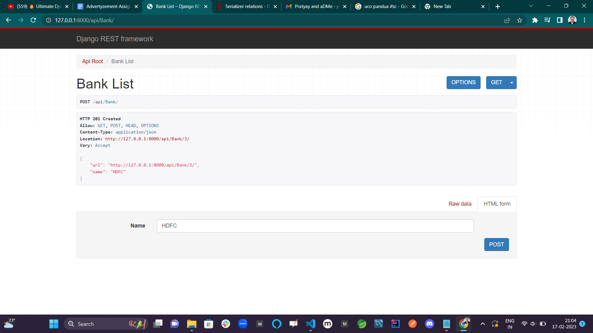
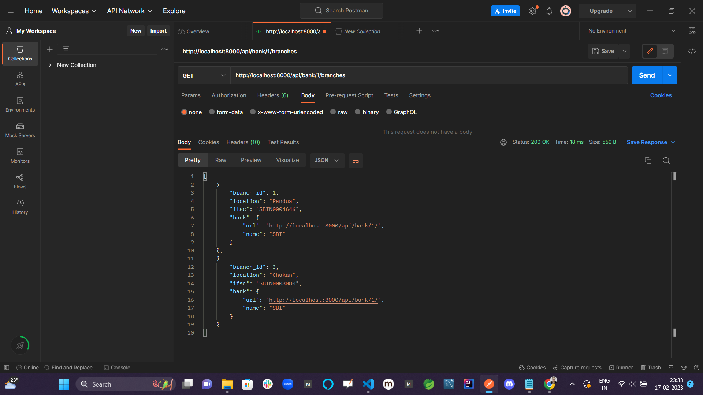
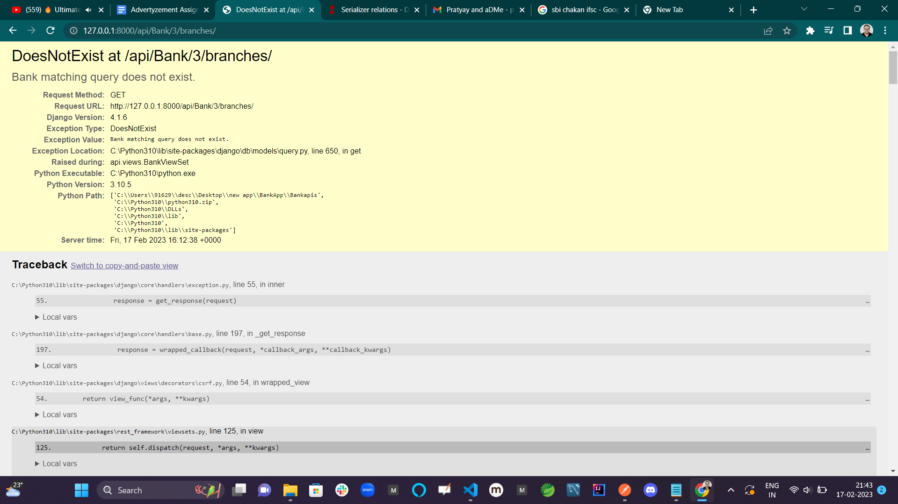
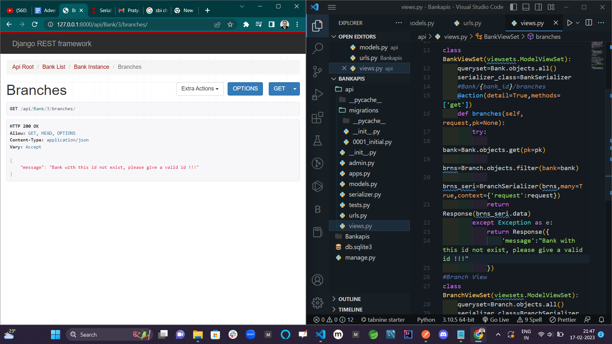
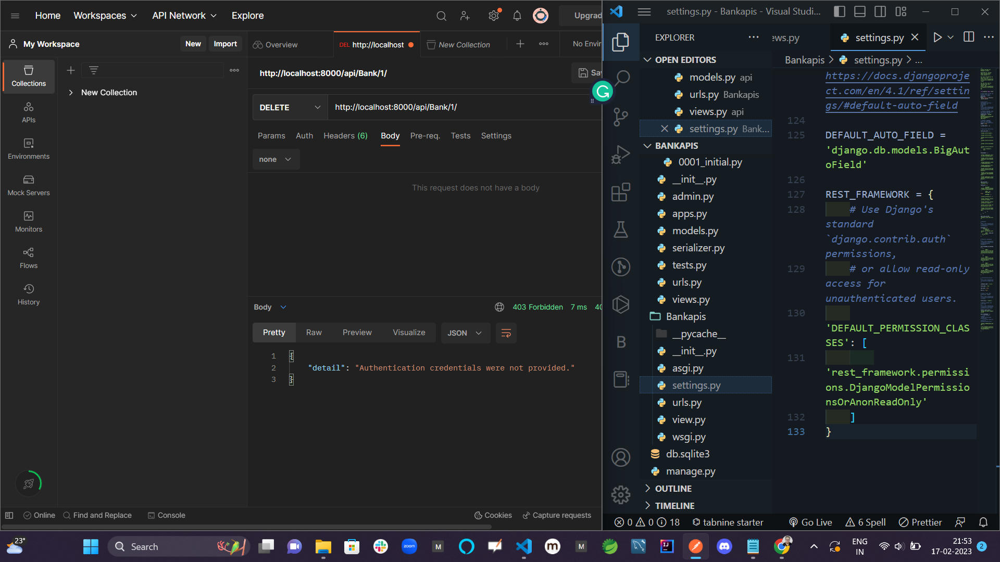
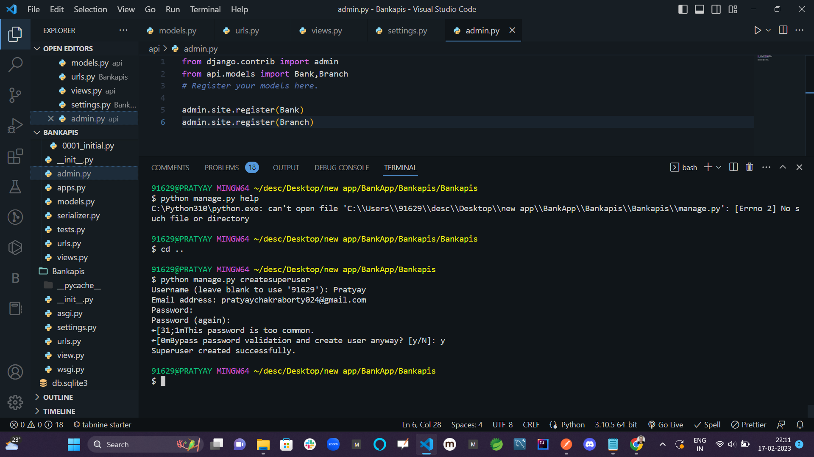
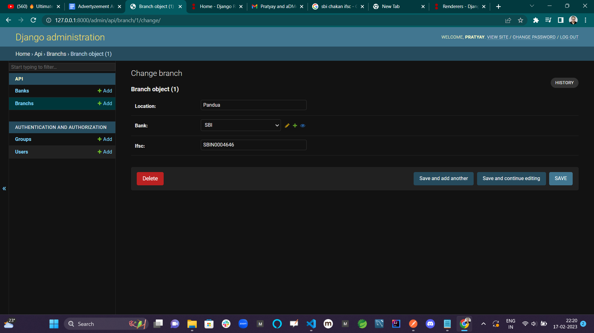

# Bank-Branch-django-Project

## Introduction 

In this project I have created some APIs for bank-branch system  created with Python, Django REST Framework, and SQLite. This Project was created whith in 9 hours along with research.

## This API has the following features:
### • Create, update and delete banks and branches 
  
###  • View banks and branches  
###  •Beside that there is an customise api for search all branches of a perticular bank  
api: http://localhost:8000/api/bank/1/branches  
 
### • Exception Handeling
#### Before
 
#### After
 
### • Authentication and authorization 
#### Provide Admin Authentication  
 
<!-- #### Super User Creation
  -->
#### Using Updatation api After login
 

The API is easy to use and understand, and it is well-documented with detailed instructions on how to use it.

This API has been tested to ensure on postman.

I hope you find this API useful.
